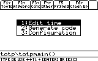
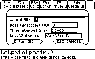
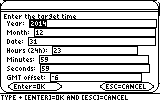
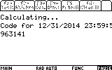

# TOTP-89

> An implementation of TOTP ([RFC 6238](https://tools.ietf.org/html/rfc6238)) in TI-BASIC for the TI-89 graphing calculator.

## Overview

This program computes two factor authentication codes using your graphing calculator. Codes can be generated for any service provider that uses the TOTP standard, such as Google. The current time, TOTP configuration parameters, and the shared secret must be entered manually into the calculator.

## Disclaimers

* Once you have entered your two factor authentication into your calculator, it is trivial for anyone with access to your calculator to read the secret out, which could reduce the security of whatever account it protects.
* It takes approximately one minute to compute each code. You will have to enter the time manually, so plan ahead and enter a time two minutes in the future.
* This is a stupid idea.

## Usage

1.   Click "Download ZIP" or clone the repository to get all of the files.

2.   Transfer all of the *.89? files to your calculator using a link cable. These will be in the "totp" folder on your calculator.

3.   Run totp/totpmain().

    

4.   Choose "Configuration," and enter the configuration parameters for your account. These can be decoded from the QR code you get when setting up two-factor authentication on your account. If you have already set up an authentication app on your smartphone, and you have rooted your smartphone, you may also be able to retrieve the configuration from your phone memory. (on Android, `su -c strings /data/data/com.google.android.apps.authenticator2/databases/databases`) Google accounts use 6 digits, a base timestamp of 0, and an interval between codes of 30,000ms. The shared secret should be entered as a base32-encoded string, consisting of the letters A-Z (case insensitive) and digits 2-7.

    

5.   Choose "Edit time," and enter a time approximately two minutes into the future. Use a four-digit year, 24-hour clock, (no AM or PM) and enter the current GMT offset of your timezone as a number. (-5, -6, -8, 0, 1, etc.)

    

6.   Choose "Generate code" and wait for the computation to finish. Once the code has been generated, enter it on the sign-in prompt as needed, but don't click submit until the current time has caught up to the time you entered in the previous step.

    

## Other notes

Newer versions of the TI-89 include a real-time clock, which could simplify code generation. Unfortunately, my calculator is from an older hardware revision, so I wasn't able to make use of that feature. Pull requests welcome!
